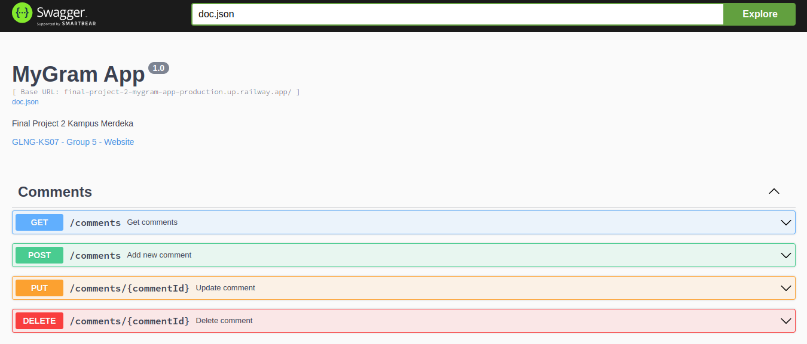
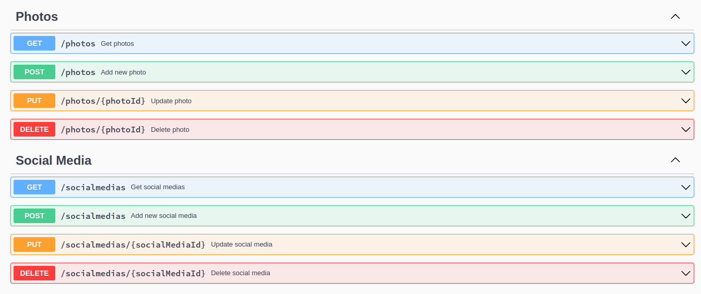
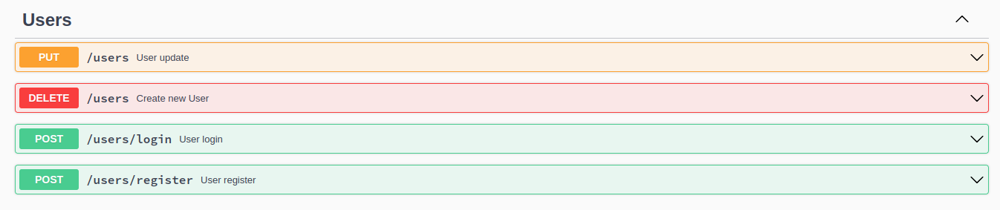

# Final Project 2 - MyGram App

Welcome to MyGram, the social media app where you can share your photos, connect with friends, and engage with comments!

<!--  -->

###Runing Code

- ** Open Your Terminal **
- ** Jalankan Perintah Dibawah ini: **
  ```
      go run main.go
  ```

## Swagger UI

### Comment



### Social Media and Photos



### Users



## MyGram API Documentation

### Users

#### Register

- **Endpoint:** {{url}}/users/register
- **Method:** POST
- **Request Body:**
  ```json
  {
    "email": "example@gmail.com",
    "password": "SuperSecret",
    "username": "example",
    "age": 22
  }
  ```

#### Login

- **Endpoint:** {{url}}/users/login
- **Method:** POST
- **Request Body:**
  ```json
  {
    "email": "example@gmail.com",
    "password": "SuperSecret"
  }
  ```

#### Update

- **Endpoint:** {{url}}/users
- **Method:** PUT
- **Request Headers:** Authorization (Bearer token string)
- **Request Body:**
  ```json
  {
    "email": "example@gmail.com",
    "password": "SuperSecret"
  }
  ```

#### Delete

- **Endpoint:** {{url}}/users
- **Method:** DELETE
- **Request Headers:** Authorization (Bearer token string)

### Photos

#### POST

- **Endpoint:** {{url}}/Photos
- **Method:** POST
- **Request Headers:** Authorization (Bearer token string)
- **Request Body:**
  ```json
  {
    "title": "Photo Github",
    "caption": "My Profile Photo On Github",
    "photo_url": "https://avatars.githubusercontent.com/u/88541910?v=4"
  }
  ```

#### Get

- **Endpoint:** {{url}}/Photos
- **Method:** GET
- **Request Headers:** Authorization (Bearer token string)

#### Update

- **Endpoint:** {{url}}/Photos
- **Method:** PUT
- **Request Headers:** Authorization (Bearer token string)
- **Request Body:**
  ```json
  {
    "title": "Github Profile Photo",
    "caption": "Github Profile",
    "photo_url": "https://avatars.githubusercontent.com/u/88541910?v=4"
  }
  ```

#### Delete

- **Endpoint:** {{url}}/Photos/{id_photos}
- **Method:** DELETE
- **Request Headers:** Authorization (Bearer token string)

### Social Media

#### POST

- **Endpoint:** {{url}}/Socialmedias
- **Method:** POST
- **Request Headers:** Authorization (Bearer token string)
- **Request Body:**
  ```json
  {
    "name": "Linkedin",
    "social_media_url": "https://www.linkedin.com/in/bagussuryaindrajati/"
  }
  ```

#### GET

- **Endpoint:** {{url}}/Socialmedias
- **Method:** GET
- **Request Headers:** Authorization (Bearer token string)

#### PUT

- **Endpoint:** {{url}}/Socialmedias/{id_socialmedias}
- **Method:** GET
- **Request Headers:** Authorization (Bearer token string)
- **Request Body:**
  ```json
  {
    "name": "Github.com",
    "social_media_url": "https://github.com/Bagussurya12"
  }
  ```

#### DELETE

- **Endpoint:** {{url}}/Socialmedias/{id_socialmedias}
- **Method:** DELETE
- **Request Headers:** Authorization (Bearer token string)

### Comment

#### POST

- **Endpoint:** {{url}}/comments
- **Method:** POST
- **Request Headers:** Authorization (Bearer token string)
- **Request Body:**
  ```json
  {
    "message": "Take Your Moment",
    "photo_id": 2
  }
  ```

#### GET

- **Endpoint:** {{url}}/comments
- **Method:** GET
- **Request Headers:** Authorization (Bearer token string)

#### PUT

- **Endpoint:** {{url}}/comments/{ID_COMENTS}
- **Method:** PUT
- **Request Headers:** Authorization (Bearer token string)
- **Request Body:**
  ```json
  {
    "message": "Foto Yang Baik Untuk Diabadikan"
  }
  ```

#### DELETE

- **Endpoint:** {{url}}/comments/{ID_COMENTS}
- **Method:** DELETE
- **Request Headers:** Authorization (Bearer token string)

### Note:

- Replace `{{url}}` with the actual base URL of your API.
- Ensure to include authentication tokens in the headers for authorized endpoints.
- Dont Forget For Configuration on .env
